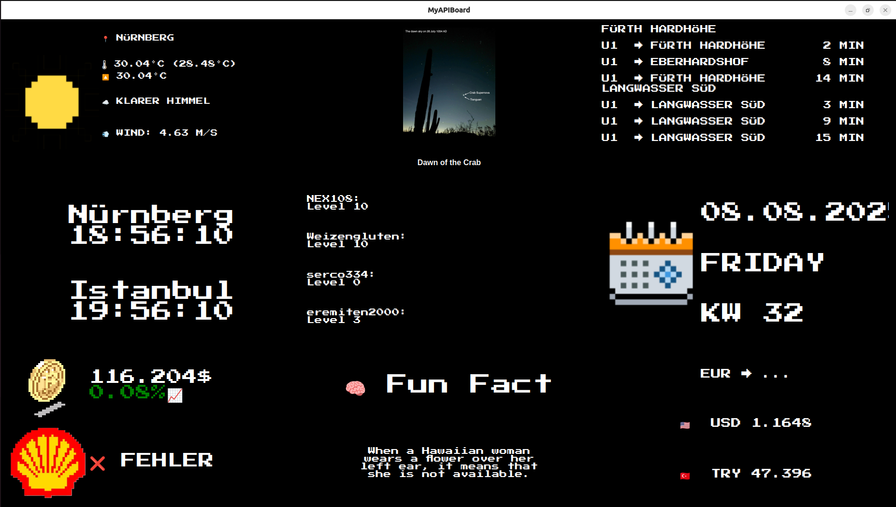

# 🖥️ MyAPIBoard – Dein persönliches API-Dashboard im Retro-Stil

**MyAPIBoard** ist eine in **Python (PyQt6)** geschriebene Desktop-Anwendung, die verschiedene Live-Informationen in Form von Widgets anzeigt – alles im coolen **Pixel-Retro-Stil**.

Aktuell enthaltene Widgets:
- 🌤 **Wetter** (OpenWeather)
- 💰 **Bitcoin-Kurs** (CoinGecko)
- 🛢 **Shell-Aktie** (Financial Modeling Prep)
- 📅 **Kalender**
- 🚇 **VGN-Abfahrten** (VAG API)
- 🧠 **Fun Fact** (uselessfacts.jsph.pl)
- 🌌 **NASA Bild des Tages**
- 🎮 **Fortnite Stats**
- 💱 **Währungsrechner** (Frankfurter API)
- 🕒 **Uhrzeit** (digital)
  
Alle Daten werden **live** über öffentliche APIs abgerufen.  
Das Ganze ist **Open Source** und die genutzten APIs sind **kostenlos** – du musst dir nur eigene API-Keys erstellen.

## Screenshot




---

## 📦 Installation

### 1️⃣ Repository klonen
```bash
git clone https://github.com/NEX108/MyAPIBoard.git
cd MyAPIBoard
```

### 2️⃣ Virtuelle Umgebung erstellen & aktivieren
```bash
python -m venv venv
source venv/bin/activate  # macOS/Linux
venv\Scripts\activate     # Windows
```

### 3️⃣ Abhängigkeiten installieren
```bash
pip install -r requirements.txt
```

---

## 🔑 API-Keys einrichten

Damit MyAPIBoard funktioniert, benötigst du **kostenlose** API-Keys von verschiedenen Diensten.  
Trage diese in die Datei `.env` ein (siehe `.env.example`).  
Die Datei `.env.example` einfach kopieren, umbenennen in `.env` und deine Keys eintragen.

| API                               | Zweck                       | Kostenloser Key                                                                                                |
| --------------------------------- | --------------------------- | -------------------------------------------------------------------------------------------------------------- |
| **OpenWeather**                   | Wetterdaten                 | [https://openweathermap.org/api](https://openweathermap.org/api)                                               |
| **Financial Modeling Prep**       | Aktienkurse (Shell)         | [https://site.financialmodelingprep.com/developer/docs](https://site.financialmodelingprep.com/developer/docs) |
| **NASA APOD**                     | NASA-Bild des Tages         | [https://api.nasa.gov](https://api.nasa.gov)                                                                   |
| **Fortnite API** (fortniteapi.io) | Fortnite-Spielerstatistiken | [https://fortniteapi.io/](https://fortniteapi.io/)                                                             |
| *(ohne Key)* CoinGecko            | Bitcoin-Kurs                | [https://www.coingecko.com/de/api](https://www.coingecko.com/de/api)                                           |
| *(ohne Key)* Frankfurter API      | Wechselkurse                | [https://www.frankfurter.app/](https://www.frankfurter.app/)                                                   |
| *(ohne Key)* Useless Facts        | Zufällige Fakten            | [https://uselessfacts.jsph.pl/](https://uselessfacts.jsph.pl/)                                                 |

---

## ▶️ Starten
```bash
python main.py
```

---

## ⚙️ Konfiguration

Viele Einstellungen (z. B. Haltestelle für VGN, Spielernamen für Fortnite) kannst du direkt in den jeweiligen Widget-Dateien oder über `.txt`-Dateien in `widgets/assets` ändern.

---

## 🖤 Features

- Komplett im **Pixel-Art-Look** (inkl. Icons und Fonts)
- Alle Widgets passen sich **automatisch der Fenstergröße** an
- 100% lokal – keine Speicherung deiner Daten
- Modular aufgebaut – einfach eigene Widgets hinzufügen

---

## 📜 Lizenz

Dieses Projekt ist **Open Source** unter der **MIT-Lizenz**.  
Du kannst es frei anpassen, erweitern und verwenden.
